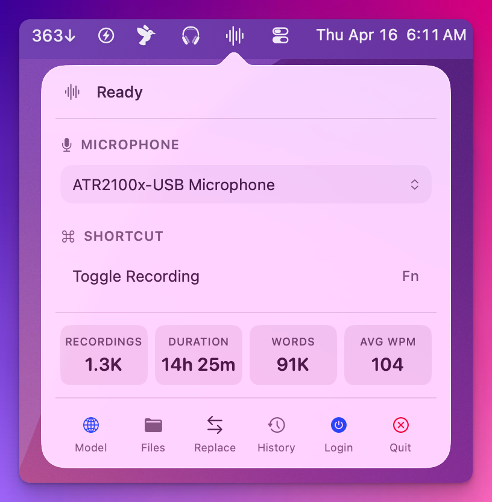

# MiniWhisper

A minimal macOS menu bar app for voice-to-text with fast on-device transcription via [Parakeet](https://github.com/FluidInference/FluidAudio) (English + 20 European languages) and broader multilingual transcription via [whisper.cpp](https://github.com/ggml-org/whisper.cpp). Press a hotkey, speak, and the transcription is automatically pasted into the active app.


[Getting Started](#getting-started) · [Features](#features) · [Troubleshooting](#troubleshooting) · [Build](#build-commands)

<p align="center">
  
</p>

## Getting Started

1. [**Download MiniWhisper**](https://github.com/andyhtran/MiniWhisper/releases/latest/download/MiniWhisper.dmg)
2. Open the DMG and drag the app to your Applications folder
3. Launch MiniWhisper from Applications (or search "MiniWhisper" in Spotlight)
4. Grant microphone and accessibility permissions when prompted
5. Look for the MiniWhisper icon in your menu bar (top-right of your screen)
6. Press **Option + W** to start recording, press it again to stop — the transcription is pasted into the frontmost app

Press **Escape** to cancel a recording. To change the hotkey, click the MiniWhisper icon in the menu bar and set a new shortcut (e.g. **Fn**).

<details>
<summary>Other install methods</summary>

### Homebrew

```bash
brew install --cask andyhtran/tap/miniwhisper
```

To update:

```bash
brew update && brew upgrade --cask miniwhisper
```

### Build from source

Requires macOS 14+ (Sonoma) and Swift 6+.

```bash
git clone https://github.com/andyhtran/MiniWhisper.git
cd MiniWhisper
just dev
```

</details>

## Features

- **Auto-paste** — transcriptions go straight into whatever app you're using
- **Customizable hotkey** — change the toggle shortcut from the menu bar panel
- **Text replacements** — auto-correct words or phrases after transcription
- **Recording history** — browse and copy recent transcriptions
- **Usage stats** — track recordings, speaking time, word count, and average WPM
- **Multiple models** — switch between the default fast model (Parakeet: English + 20 European languages) and multilingual auto-detect (whisper.cpp)
- **On-device** — all processing happens locally on your Mac, nothing leaves your device

## Troubleshooting

**Can't find the menu bar icon?**

macOS hides menu bar icons that don't fit near the clock. If you have many menu bar apps, MiniWhisper's icon may be pushed out of view.

- **Hold ⌘ and drag** the MiniWhisper waveform icon closer to the clock to keep it visible
- Open **System Settings → Control Center → Menu Bar Only** and hide icons you don't need
- In MiniWhisper's settings, click **Open Menu Bar Settings** to jump there directly

MiniWhisper will show a hint about this the first few times it launches. You can also reopen the app from Spotlight or the Dock to bring the popover back.

## Build commands

```bash
just dev          # Build, package, and launch
just build        # Debug build only
just release      # Release build + .app bundle
just clean        # Remove build artifacts
```

To re-test the menu bar visibility hint (resets after 3 shows or manual dismiss):

```bash
defaults delete com.miniwhisper.dev MenuBarVisibilityHintShownCount
defaults delete com.miniwhisper.dev MenuBarVisibilityHintDismissed
just dev
```

## Release

Signing, notarization, and publishing require [`asc`](https://github.com/rudrankriyam/App-Store-Connect-CLI):

```bash
brew install asc
```

See `just --list` for the full set of release recipes (`sign-and-notarize`, `github-release`, `publish`, etc.).

## Configuration

Copy `.envrc.example` to `.envrc` and fill in your values. If using [direnv](https://direnv.net/), run `direnv allow`.

For local development, ad-hoc signing works out of the box — no Apple Developer account needed.

## License

[MIT](LICENSE)
